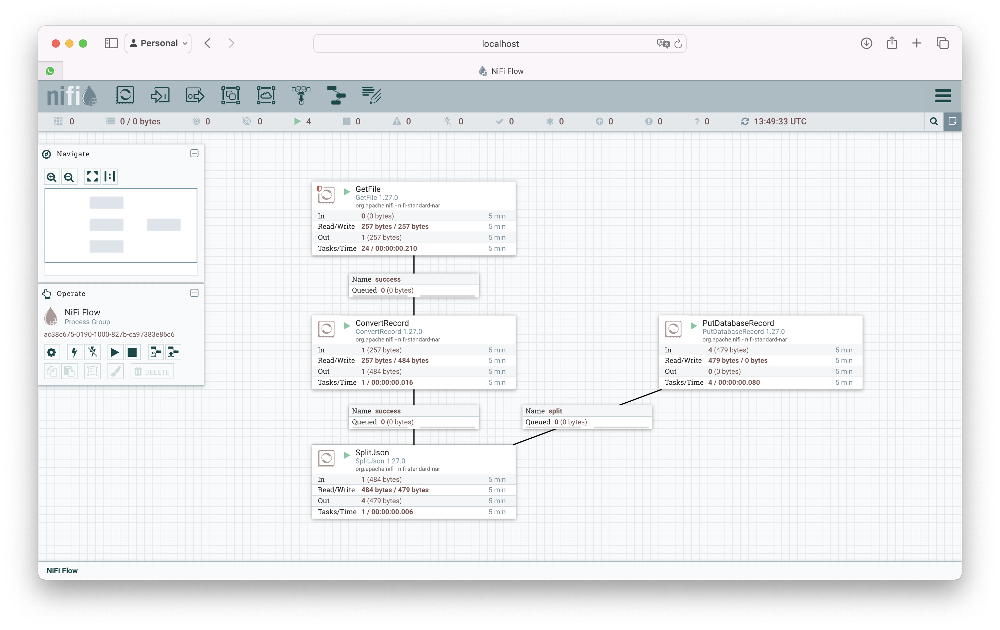

# Ingest MySQL Sample
Testing ingest data on MySQL



## Get Started
1- Up ecossystem.
```bash
docker-compose up -d
```
2- Copy driver to container
```bash
docker cp data/util/mysql-connector-j-8.0.33.jar nifi:/opt/nifi/nifi-current/lib
```
3- Give access to mysql user with
```SQL
GRANT ALL PRIVILEGES ON Bronze.* TO 'pmoreira'@'%';
FLUSH PRIVILEGES;
```

## NiFi Parameters
Parameter Name|Value
--|--
db.conn|jdbc:mysql://db/bronze
db.driver.name|com.mysql.cj.jdbc.Driver
db.driver.path|/opt/nifi/nifi-current/lib
db.user|pmoreira
db.password|pmoreira